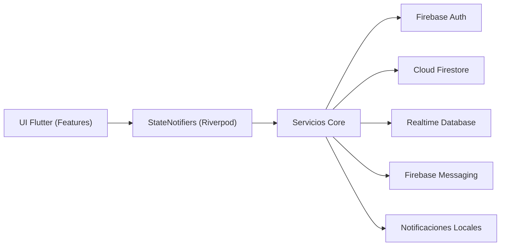

# Aethera

<p align="center">
  <strong>Un universo emocional para parejas a distancia.</strong><br/>
  Construido con Flutter + Firebase para convertir la conexión diaria en un mundo vivo compartido.
</p>

<p align="center">
  
  
  
  
  
  
</p>

---

## Visión del Producto

La mayoría de apps para parejas a distancia se quedan en el chat.
Aethera transforma cada interacción emocional en progreso real:
cada check-in, memoria, ritual, latido y meta compartida cambia visualmente su universo.

Este proyecto combina:

- Pensamiento de producto (retención, progresión, UX emocional)
- Sistemas en tiempo real (presencia, sincronización, eventos push)
- UI de alto impacto visual (capas animadas + glassmorphism)
- Arquitectura mantenible para crecer a producción

---

## Lo que lo Hace Especial

- Universo compartido en tiempo real que reacciona al estado de la pareja
- Flujo de vinculación por código de invitación
- Ritual semanal con revelado asíncrono de respuestas
- Presencia y latidos con Firebase Realtime Database
- Motor de progresión con rachas, puntos y niveles del universo
- Notificaciones push y locales (FCM + Flutter Local Notifications)
- Audio ambiental adaptativo según emoción combinada
- Arquitectura modular (`core`, `features`, `shared`) con Riverpod + GoRouter

---

## Arquitectura



### Stack Tecnológico

- Frontend: Flutter, Dart, Material 3
- Estado: Riverpod (`StateNotifier`)
- Navegación: `go_router`
- Backend:
  - Firebase Authentication
  - Cloud Firestore
  - Firebase Realtime Database
  - Firebase Cloud Messaging
  - Firebase Storage
- UX y Animación:
  - `flutter_animate`
  - CustomPainter y fondos animados por capas
- Audio:
  - `audioplayers`

---

## Estructura del Proyecto

```text
lib/
├── core/
│   ├── constants/      # reglas de progresión y constantes globales
│   ├── providers/      # estado global y ciclo de vida
│   ├── router/         # navegación protegida
│   ├── services/       # firebase, notificaciones, presencia, ritual, audio
│   ├── theme/          # tokens y sistema visual
│   └── utils/          # utilidades de dominio (ej: rachas)
├── features/
│   ├── auth/
│   ├── onboarding/
│   ├── pairing/
│   ├── profile/
│   ├── ritual/
│   ├── splash/
│   └── universe/
└── shared/
    ├── models/         # modelos de dominio tipados
    └── widgets/        # componentes reutilizables
```

---

## Calidad de Ingeniería

- Análisis estático: `flutter analyze` sin issues
- Pruebas automatizadas:
  - lógica de rachas
  - serialización de `MemoryModel`
  - interacción de widget (`AetheraButton`)
- Endurecimiento de confiabilidad:
  - sincronización de token FCM robusta ante cambios de auth
  - rachas protegidas con transacciones en Firestore
  - eliminación de falsos positivos en notificación de memorias
  - fallback mock restringido solo a debug

---

## Inicio Rápido

### 1) Requisitos

- Flutter SDK 3.x
- Dart SDK (incluido con Flutter)
- Proyecto Firebase con apps Android/iOS/Web configuradas

### 2) Instalar dependencias

```bash
flutter pub get
```

### 3) Configurar Firebase

```bash
flutterfire configure
```

Nota de seguridad:

- `lib/firebase_options.dart` en este repositorio está sanitizado intencionalmente.
- `android/app/google-services.json` no se versiona; usa `android/app/google-services.json.example` solo como referencia de estructura.
- Genera tus configuraciones reales en local con FlutterFire/Firebase Console y mantén esos archivos fuera de Git.

Asegúrate de habilitar en Firebase Console:

- Authentication (Email/Password)
- Cloud Firestore
- Realtime Database
- Cloud Messaging
- Cloud Storage

### 4) Ejecutar la app

```bash
flutter run
```

### 5) Verificar calidad

```bash
flutter analyze
flutter test
```

---

## Hoja de Ruta

- Memorias multimedia con galería y timeline
- Prompts de ritual inteligentes con personalización adaptativa
- Sistema de progresión ampliado con hitos y artefactos
- Analítica de producto + base para experimentos A/B
- CI/CD con compuertas de calidad

---

## Autor

**Jheisson Loor**  
Ingeniero Mobile enfocado en experiencias Flutter orientadas a producto, arquitectura en tiempo real y ejecución visual premium.
