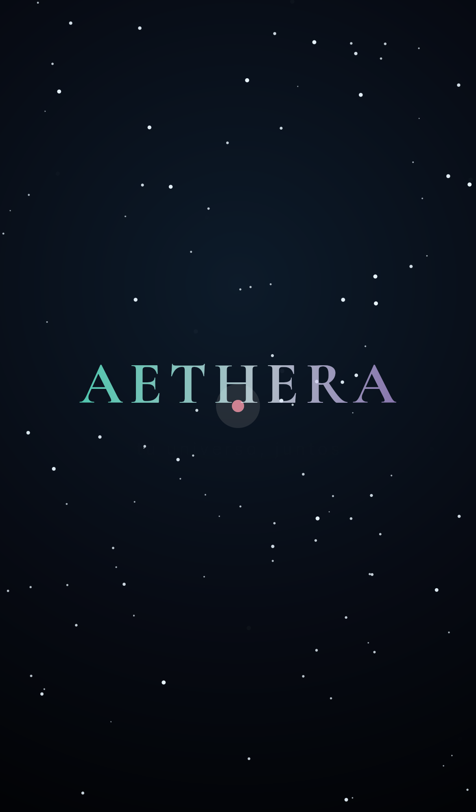
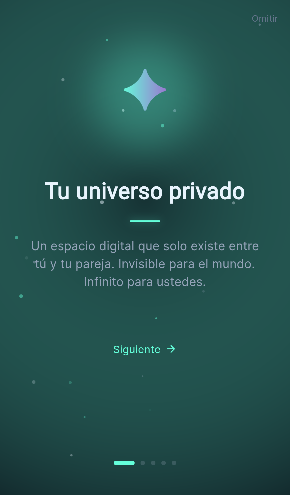
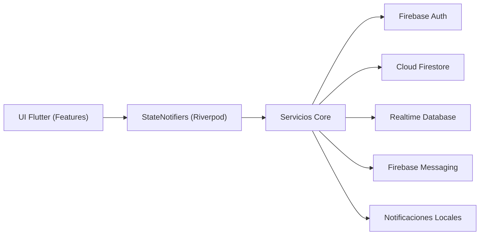

# Aethera

<p align="center">
  <strong>Un universo emocional para parejas a distancia.</strong><br/>
  Diseno visual cinematografico, arquitectura modular y base real-time con Flutter + Firebase.
</p>

<p align="center">
  
  
  
  
  
  
</p>

<p align="center">
  
</p>

---

## Demo visual

<p align="center">
  
  
</p>

---

## Que hace especial a Aethera

- Universo compartido que evoluciona con la conexion emocional de la pareja.
- Experiencia visual en capas: cielo emocional, aurora, estrellas, memorias y horizonte de metas.
- Diseno de producto orientado a retencion: ritual semanal, rachas, puntos y progresion.
- Arquitectura preparada para escalar a produccion con separacion por dominios (`core`, `features`, `shared`).

---

## Arquitectura (alto nivel)



---

## Stack tecnologico

- `Flutter` + `Dart`
- Estado con `flutter_riverpod`
- Navegacion con `go_router`
- Backend con `Firebase` (Auth, Firestore, Realtime DB, Messaging, Storage)
- UI y motion con `flutter_animate` + sistema visual propio (`AetheraTokens`)

---

## Estructura del proyecto

```text
lib/
|-- core/
|   |-- constants/
|   |-- providers/
|   |-- router/
|   |-- services/
|   |-- theme/
|   `-- utils/
|-- features/
|   |-- auth/
|   |-- onboarding/
|   |-- pairing/
|   |-- profile/
|   |-- ritual/
|   |-- splash/
|   `-- universe/
`-- shared/
    |-- models/
    `-- widgets/
```

---

## Inicio rapido

### 1) Requisitos

- Flutter SDK 3.x
- Dart SDK (incluido en Flutter)
- Proyecto Firebase configurado para Android/iOS/Web

### 2) Instalar dependencias

```bash
flutter pub get
```

### 3) Configurar Firebase (local)

```bash
flutterfire configure
```

Notas de seguridad del repositorio:

- `lib/firebase_options.dart` esta sanitizado intencionalmente.
- `android/app/google-services.json` no se versiona.
- Usa `android/app/google-services.json.example` solo como plantilla.

### 4) Ejecutar

```bash
flutter run
```

### 5) Calidad

```bash
flutter analyze
flutter test
```

---

## CI y estandares del repositorio

- Pipeline de CI en GitHub Actions: `.github/workflows/ci_flutter.yml`
- Guia de colaboracion: `CONTRIBUTING.md`
- Codigo de conducta: `CODE_OF_CONDUCT.md`
- Licencia: `LICENSE`

---

## Roadmap tecnico

- Integracion completa con Firestore/Realtime DB en todos los flujos.
- Memorias multimedia con timeline visual.
- Ritual semanal enriquecido y personalizable.
- Metricas de producto y base para experimentacion A/B.

---

## Autor

**Jheisson Loor**  
Ingeniero Flutter enfocado en producto, tiempo real y experiencias visuales.
